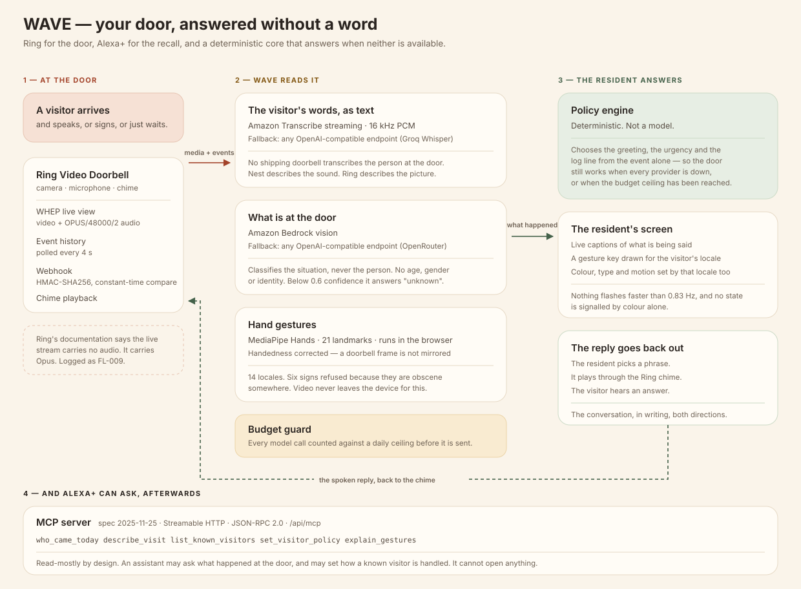
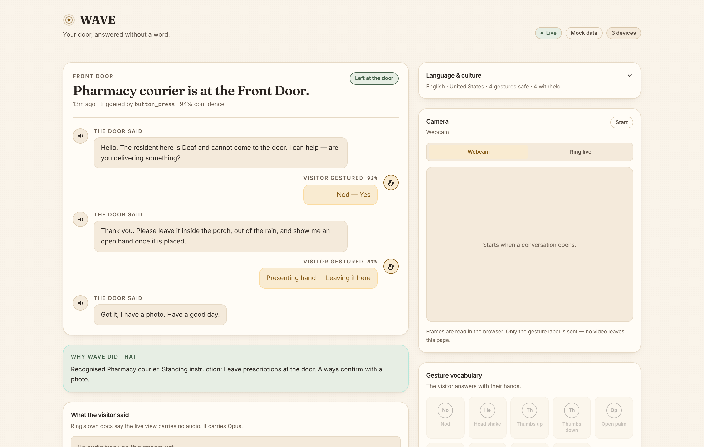
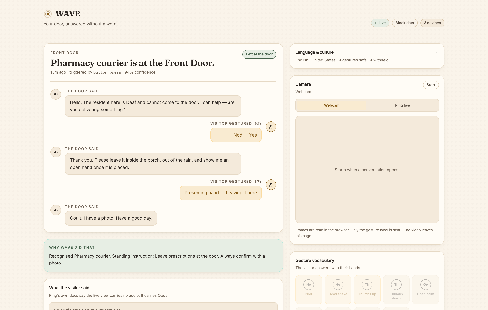
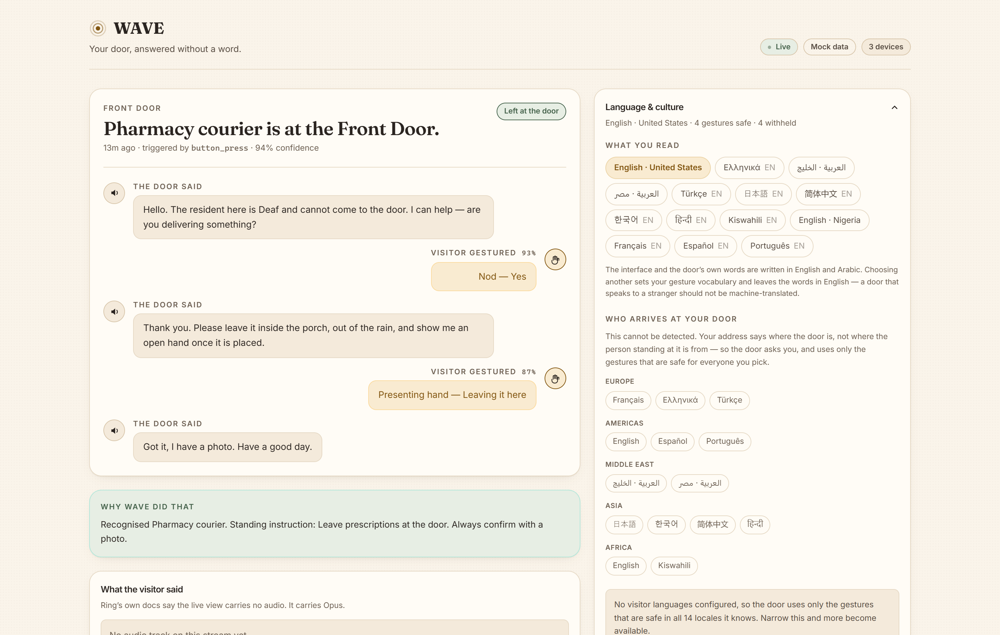
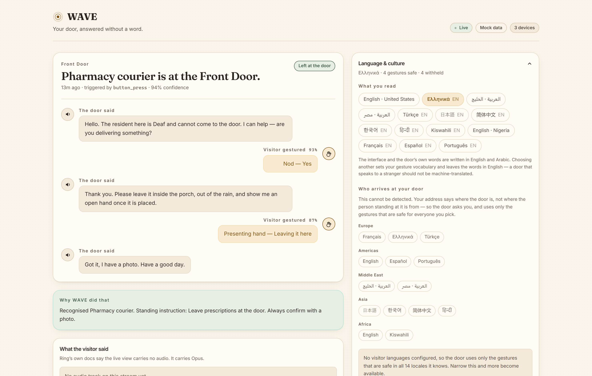
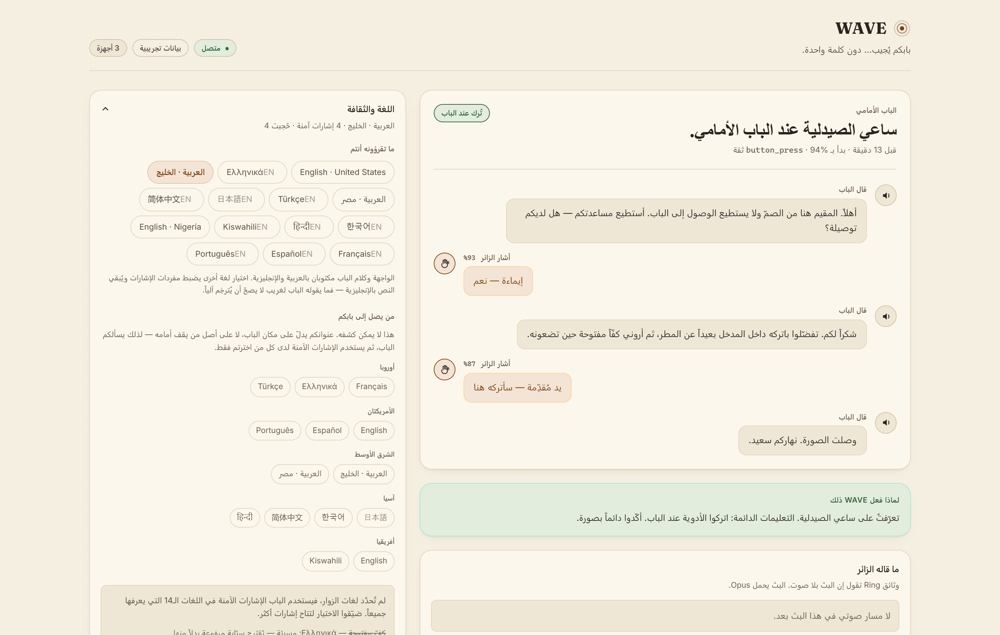
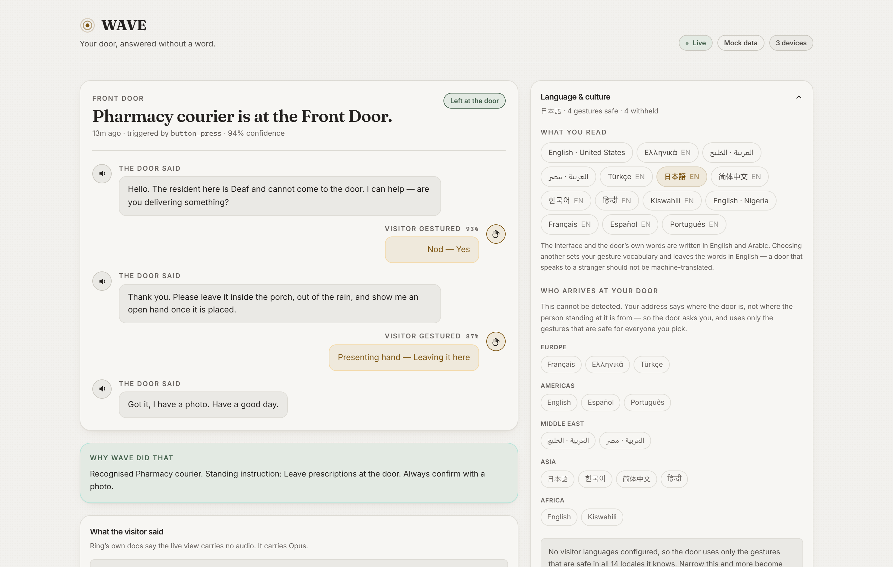

# WAVE

**Your door, answered without a word.**

An accessible front-door agent for people who are Deaf, hard of hearing, non-verbal, or
unable to get to the door. Built on the Ring Partner API for the *Build, Ship, Shape:
Amazon Developer Hackathon*.

- **Live:** <https://wave-tan-nine.vercel.app>
- **Primary tracks:** Ring · Alexa+
- **Mini challenges:** AWS Builder · Open Source
- **Spun out of this repo:** [`gesture-locale`](https://github.com/321abdulfatah/gesture-locale) — MIT, no dependencies

---

## The idea

Every doorbell ever built assumes you can hear.

The AI ones are worse about it than the old ones. Alexa+ Greetings will answer your door with
generative AI and hand you a **recording** of what happened. Ring's AI Video Descriptions
describe the picture and not the speech. Google Nest states outright that it captions only
non-verbal sounds — it will tell a Deaf user that a doorbell rang, and will not tell them
what the person standing there said.

Amazon already ships Call Captioning and Real Time Text on Echo Show. Both are scoped to
Alexa calls. Neither reaches the front door.

**WAVE gives you the conversation instead of the sound — in writing, in both directions.**
The visitor's speech becomes captions. Their gestures are read in the vocabulary of their own
culture. The resident answers by picking a phrase, and it plays out of the Ring chime, so the
person outside hears a reply.

### One thing we found on the way

Ring's Partner API documentation says the live stream carries no audio.

It carries `OPUS/48000/2`. The WHEP answer negotiates it. The entire captioning feature
exists because the documentation was wrong, and that is written up as **FL-009** in
[FRICTION_LOG.md](FRICTION_LOG.md) along with nine other things that cost real time.

---

## How it works



| | |
|---|---|
|  |  |
| The resident's screen. | A courier arrives; WAVE opens with the household's standing instruction and says why. |
|  |  |
| Two separate questions: what you read, and who arrives at your door. | Expecting Greek visitors withdraws the open palm and offers a raised index instead. |
|  |  |
| A full RTL pass — the transcript re-renders, because turns are stored as keys. | Paper, typeface and line height follow the locale: #f2f1ee and Noto Sans JP here. |

---

## Running it

No Ring account, token, or hardware is needed to see the whole product — WAVE ships a mock
mode with a scripted visitor.

```bash
npm install
npm run dev
```

Open <http://localhost:3000>, press **Courier** under *Ring the doorbell*, and answer.

```bash
npm test        # the gesture-locale package, 21 tests
npm run typecheck
```

### Against the real Ring Playground

```bash
cp .env.example .env.local
# paste your Playground token from the Ring Developer Console
```

| Variable | Purpose |
|---|---|
| `RING_ACCESS_TOKEN` | Playground token. Unset → mock mode. |
| `RING_WEBHOOK_SECRET` | Shared secret for `X-Signature` verification. |
| `AWS_REGION`, `AWS_ACCESS_KEY_ID` | Enables Amazon Transcribe and Bedrock. |
| `AI_BASE_URL`, `AI_API_KEY`, `AI_MODEL` | Vision fallback — any OpenAI-compatible endpoint. |
| `SPEECH_BASE_URL`, `SPEECH_API_KEY` | Speech fallback — anything serving `/audio/transcriptions`. |
| `MAX_VISION_CALLS_PER_DAY` | Daily ceiling on model calls. See `/api/spend`. |

Every one of these is optional. With none of them set the app still runs end to end: the
deterministic policy engine decides on its own, and each panel explains why it is empty
rather than sitting blank.

Ring rejects browser origins, so every Ring call is server-to-server from a route handler.

---

## How it is put together

```
app/
  api/ring/events        SSE feed of doorstep events
  api/ring/stream        WHEP negotiation — video and audio, recvonly
  api/captions/stream    16 kHz PCM in, caption chunks out
  api/vision             one frame in, a description of the situation out
  api/webhook            Ring receiver, HMAC verified, idempotent on request_id
  api/mcp                Model Context Protocol server for Alexa+
  api/spend              today's model-call ledger
  components/            dashboard, captions, gesture reader, locale switcher
lib/
  ring/          Partner API client, WHEP, 4-second poller
  captions/      Transcribe framing — float32 → PCM16, 48k → 16k
  gestures/      vocabulary + 14 locales + MediaPipe landmark classifier
  agent/         the deterministic policy engine, and vision
  ai/            provider resolution and the spend ceiling
  i18n/          en + ar catalogues
  locale/        the two-audience locale model
  theme/         per-culture colour, type and motion
  env.ts         every environment read, with invisible characters stripped
packages/
  gesture-locale/        the locale data, extracted as an MIT package
```

### Decisions worth calling out

**Gesture recognition runs in the browser.** MediaPipe reads the hand on the client and only
the resulting label is posted. No video frame leaves the house for this, and none reaches a log.

**The conversation engine is deterministic.** A model captions and classifies, but every
branch that decides what actually happens lives in `lib/agent/policy.ts`. A door agent that
improvises is a door agent that eventually says something nobody authorised.

**No vendor is load-bearing.** WAVE was built against Bedrock and Transcribe and prefers
them. Every model call goes through `lib/ai/provider.ts`, so swapping providers is
configuration rather than a rewrite. That was not foresight — it was written the day AWS
suspended the account, and it is logged as **FL-010**.

**Vision classifies the situation, never the person.** The model is asked about parcels,
uniforms and vehicles. It is never asked anyone's age, gender, race or identity. Below 0.6
confidence the answer is `unknown`, which has a safe greeting; a confident wrong answer
greets a neighbour as a courier.

**Model spend has a ceiling.** Counted in calls rather than dollars, because a running
dollar total means trusting a price table that changes. `lib/ai/budget.ts` says plainly what
it does and does not guarantee.

---

## Culture is not a translation layer

A thumbs-up is obscene in parts of West Africa and the Middle East. The ring gesture is
obscene in Brazil. A raised open palm is a grave insult in Greece. A door agent that shows a
stranger the wrong hand shape has not made a cosmetic mistake.

So the gesture vocabulary is per-locale, and 14 locales are described in
[docs/gesture-locales.md](docs/gesture-locales.md). Every blocked gesture carries a reason,
a severity and an **evidence grade** — peer-reviewed, institutional, tertiary or unverified —
because several widely repeated claims in this area turn out to trace back to nothing. The
ones we could not substantiate are listed as withdrawn rather than quietly dropped.

The interface follows: colour, type and motion change with the locale, not just the strings.
Arabic is a full RTL pass using logical properties, not a mirrored stylesheet.

---

## Accessibility

The product is for disabled users, so the interface is held to the same standard as the idea.

- Nothing flashes faster than **0.83 Hz** — WCAG 2.3.1 and 2.3.2 allow three per second, and
  this sits 3.6× under that
- No state is signalled by colour alone (WCAG 1.4.1); every non-text indicator clears **3:1**
  (WCAG 1.4.11), which is how the original ochre was caught at 2.72:1 and darkened
- Every animation collapses to a static state under `prefers-reduced-motion`
- Events are announced through an assertive live region — deafness and low vision co-occur
  often enough that assuming a Deaf user is not also using a screen reader would be careless
- Gestures below their confidence threshold are treated as unread and re-prompted, never
  guessed at

---

## Alexa+

`/api/mcp` is a Model Context Protocol server (spec 2025-11-25, Streamable HTTP, JSON-RPC 2.0)
exposing five tools: `who_came_today`, `describe_visit`, `list_known_visitors`,
`set_visitor_policy`, `explain_gestures`.

It is read-mostly on purpose. An assistant may ask what happened at the door and set how a
known visitor is handled. It cannot open anything.

---

## Status

[PLAN.md](PLAN.md) has the schedule and the open validation gates.
[FRICTION_LOG.md](FRICTION_LOG.md) is the developer-experience log kept during the build —
ten entries, two of them rated critical.
[SUBMISSION.md](SUBMISSION.md) is the Devpost write-up.

## License

MIT
